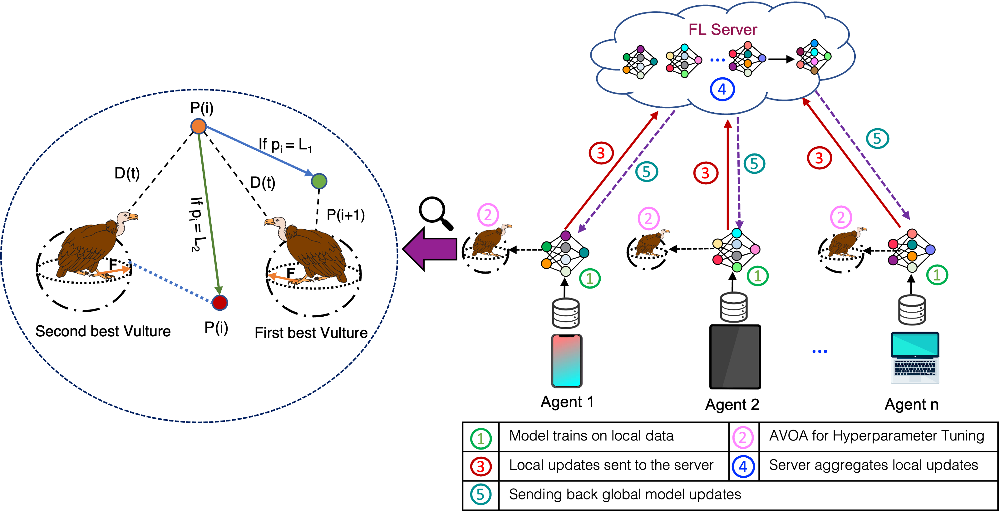
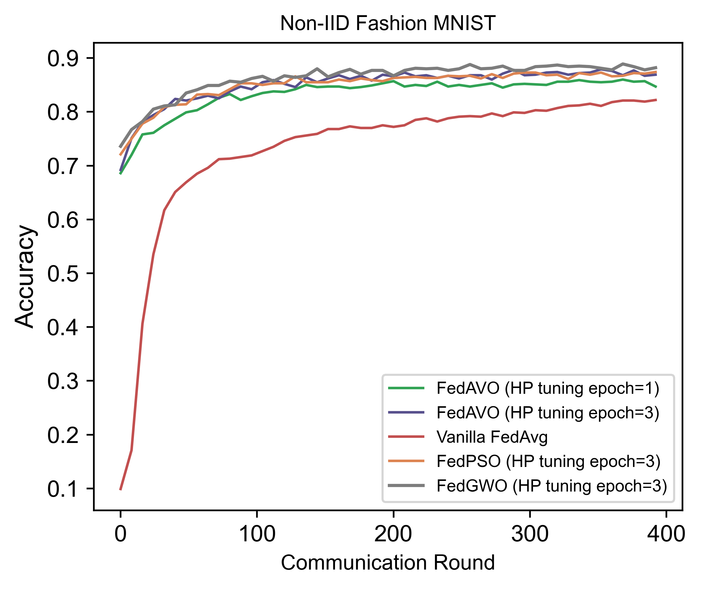
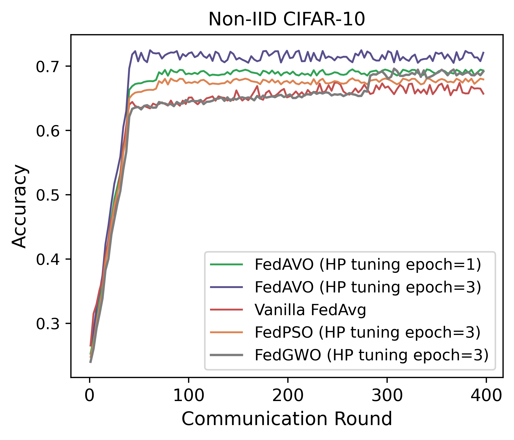
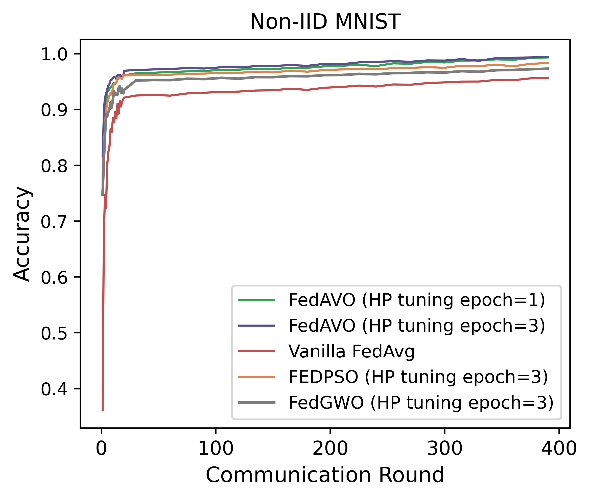

# FedAVO

Federated Learning (FL), a distributed machine
learning technique has recently experienced tremendous growth
in popularity due to its emphasis on user data privacy. However,
the distributed computations of FL can result in constrained
communication and drawn-out learning processes, necessitating
the client-server communication cost optimization. The ratio
of chosen clients and the quantity of local training passes are
two hyperparameters that have a significant impact on the
performance of FL. Due to different training preferences across
various applications, it can be difficult for FL practitioners to
manually select such hyperparameters. In our research paper,
we introduce FedAVO, a novel FL algorithm that enhances
communication effectiveness by selecting the best hyperparameters
leveraging the African Vulture Optimizer (AVO). Our research
demonstrates that the communication costs associated with FL
operations can be substantially reduced by adopting AVO for
FL hyperparameter adjustment. Through extensive evaluations
of FedAVO on benchmark datasets, we show that FedAVO
achieves significant improvement in terms of model accuracy and
communication round, particularly with realistic cases of Non-
IID datasets. Our extensive evaluation of the FedAVO algorithm
identifies the optimal hyperparameters that are appropriately
fitted for the benchmark datasets, eventually increasing global
model accuracy by 6% in comparison to the state-of-the-art FL
algorithms (such as FedAvg, FedProx, FedPSO, etc.)


## System Architecture





## Installation

First, you need to install the project dependencies. To do this, navigate to the project directory and run the following command:

```
pip install -r requirements.txt
```

This will install all the necessary packages for the project.

## Running the Project

To run the project, use the following command in your terminal:

**Example**: 
```
python3 main.py --optimizer= fedavo \
--data_split=iid --num_rounds=400 \
--clients_per_round=10 --batch_size = 4\
--num_epochs=5 --tuning_epoch=3 --train_samples=500
```

This will execute the `main.py` file, which contains the main code for the project. 


**GUIDELINES**: 
Integration of FedAVO is feasible with diverse federated learning approaches and adaptable to various datasets.\ By adjusting the problem space (Which can be located in fedavo.py, under optimizers folder), one can achieve optimal tuning.
```
problem = {
      "fit_func":objective_function ,
      "lb": [0.1, 0.0000000001,0.0000000001 ], //lower limit
      "ub": [0.1,0.000000001 ,0.000000001], // upper limit
      "minmax": "min"}

```


## EXPERIMENTAL RESULTS

  

## Contribution
@authors 
- Md Zarif Hossain,<br>
  Graduate Research Assistant, Southern Illinois University, Carbondale
  
- Ahmed Imteaj,<br>
  Assistant Professor, Southern Illinois University, Carbondale

## REFERENCES 
See our [FedAVO](https://arxiv.org/abs/2305.01154) paper for more details as well as all references.


