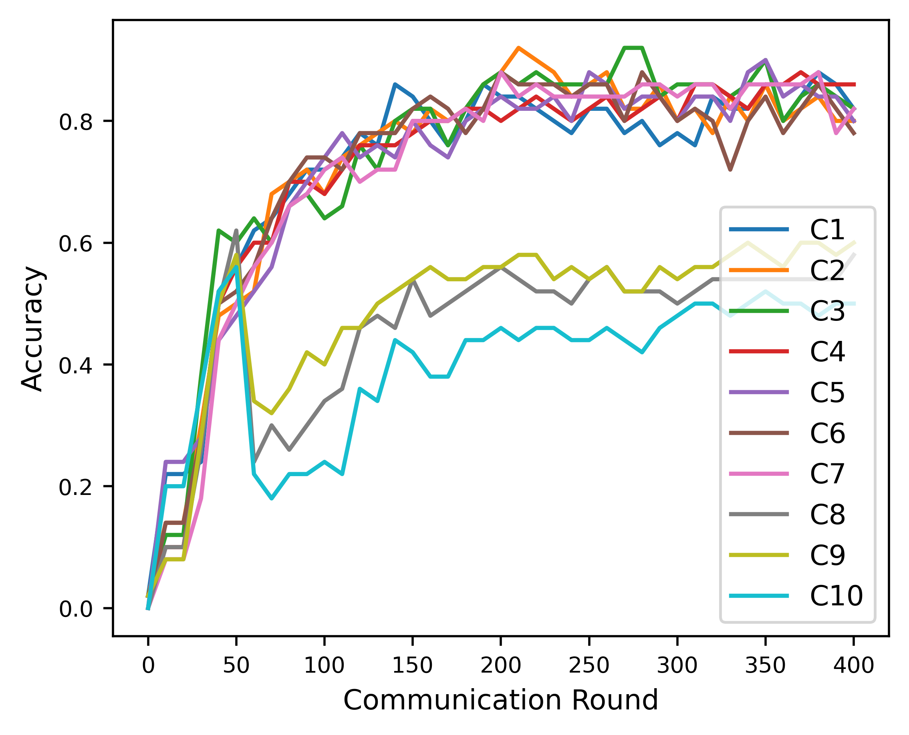
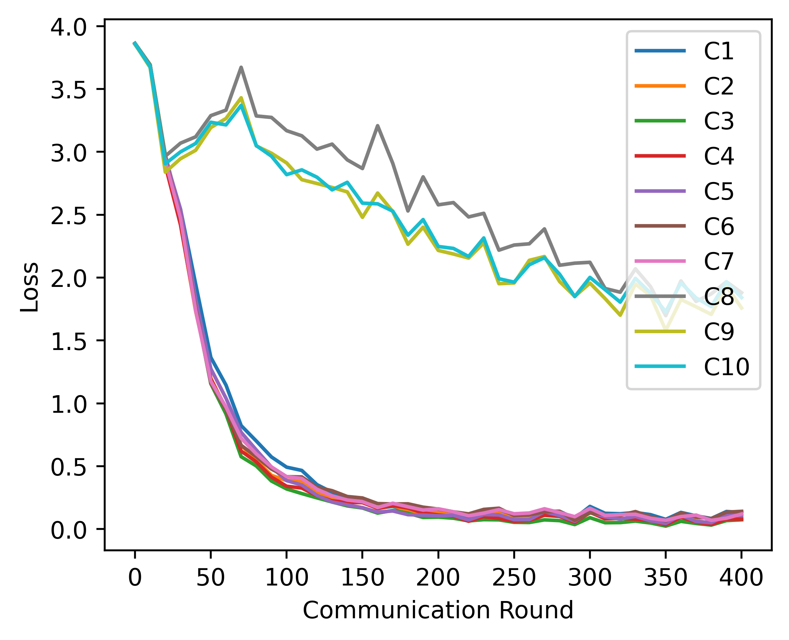

# FLID: Intrusion Attack and Defense Mechanism for Federated Learning Empowered Connected Autonomous Vehicles (CAVs) Application

Connected autonomous vehicles (CAVs) are trans-
forming the transportation business by incorporating advanced
technology such as sensors, communication systems, and artificial
intelligence. However, the interconnectedness and complexity
of CAVs pose security vulnerabilities, making them possible
targets for assaults. Intrusion detection is critical in protecting
CAVs from harmful actions. This research investigates the use
of federated learning, a privacy-preserving machine learning
approach, for intrusion detection in CAVs. Federated Learning
(FL) can improve the detection capabilities and robustness of
intrusion detection systems in the CAV ecosystem by using the
collective capacity of various CAVs while protecting data privacy.
This paper provides an in-depth analysis of tailoring FL for
collaborative intrusion detection in CAVs, as well as prospective
future research areas in this domain. The findings of this study
contribute to the advancement of secure and dependable CAV
systems, opening the path for the widespread use of connected
autonomous vehicles in the transportation industry

## Installation

First, you need to install the project dependencies. To do this, navigate to the project directory and run the following command:

```
pip install -r requirements.txt
```

This will install all the necessary packages for the project.

## Running the Project

To run the project, use the following command in your terminal:

**Example**: 
```
python3 main.py --optimizer= sgd \
--data_split=iid --num_rounds=400 \
--clients_per_round=10 --batch_size = 4\
--num_epochs=5 --poison=20
```

This will execute the `main.py` file, which contains the main code for the project. 

## Results generated for 30% poison

 


```
Note: Here Poison parameter refers to the poison level for the simulation. The parameter has to be in **percentage**
format. e.g For 100 clients 20% poison refers to 20 clients of the 100 clients will be poisoned. 
```
